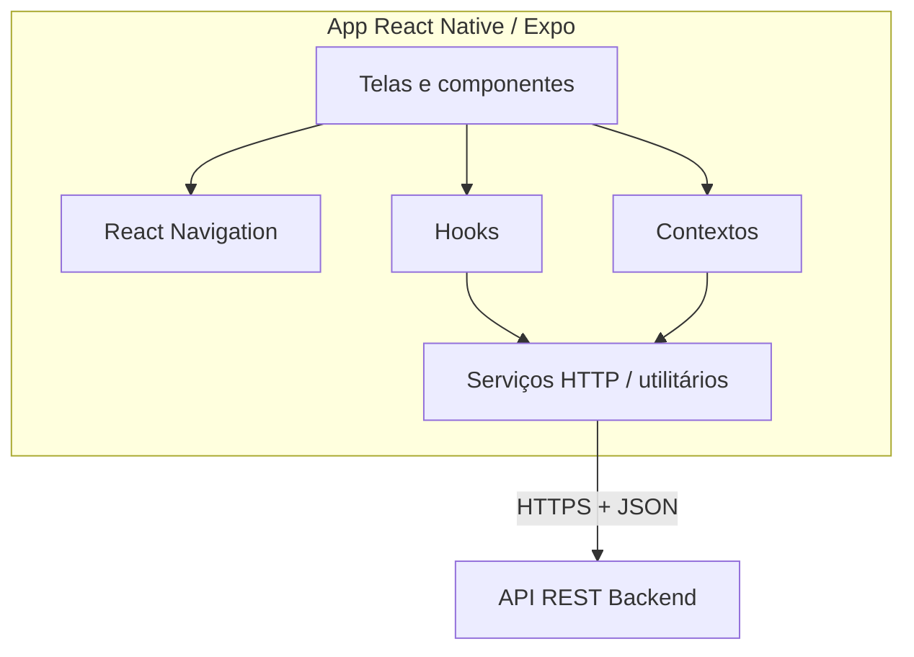

# Documentação técnica — Front-end

Este documento atende às seções de **arquitetura e testabilidade do front-end**, **qualidade de código (convenções)** e **qualidade de testes e de uso**, conforme orientação da disciplina. O escopo aqui é **apenas o front-end** do aplicativo mobile do repositório.

---

## 1. Arquitetura e estrutura do front-end

### 1.1 Visão geral

O aplicativo é um **cliente mobile** (React Native + Expo) que consome uma **API HTTP** (base URL via variável de ambiente), com navegação entre telas públicas (autenticação/cadastro) e área logada (home, fretes, mapa, perfil).

### 1.2 Stack tecnológica

| Camada | Tecnologia | Motivo da escolha |
|--------|------------|-------------------|
| Runtime / build | Expo SDK 54 | Desenvolvimento unificado (Android/iOS/web), tooling e atualizações alinhadas ao ecossistema React Native |
| UI | React 19 + React Native | Componentes declarativos e ecossistema maduro |
| Estilo | NativeWind + Tailwind CSS | Estilização utilitária consistente com classes semelhantes ao web |
| Navegação | React Navigation (native stack, bottom tabs) | Padrão da comunidade para fluxos stack + abas |
| Formulários | react-hook-form | Estado de formulário e validação com menos boilerplate |
| HTTP | Axios (`src/services/http.ts`) | Cliente HTTP com interceptors (token, idioma) |
| i18n | i18next + react-i18next | Textos externalizados e suporte a múltiplos idiomas |
| Mapas | Mapbox (`@rnmapbox/maps`) | Visualização de rotas e mapa no fluxo de fretes |
| Armazenamento seguro | expo-secure-store | Persistência de token e preferências sensíveis |
| Qualidade | ESLint (expo), TypeScript | Tipagem estática e regras de código |

### 1.3 Módulos e camadas

Organização principal em `App/src/`:

| Pasta | Responsabilidade |
|-------|------------------|
| `screens/` | Telas completas (autenticação, cadastro, home, fretes, mapa, perfil) |
| `components/` | UI reutilizável (formulários, cabeçalhos, cards, modais) |
| `routes/` | Definição de navegação (`Routes`, `RoutesTabs`, rotas privadas) |
| `context/` | Estado global (autenticação, tema, cadastro, veículo, alertas) |
| `hooks/` | Lógica reutilizável por domínio (auth, usuário, frete, veículo, clima) |
| `services/` | Comunicação HTTP e integrações (API, clima, localização, upload) |
| `utils/` | Validações, máscaras, formatação, helpers de mapa |
| `i18n/` | Traduções e constantes de texto |
| `types/` e `interfaces/` | Tipos TypeScript compartilhados |

Fluxo de dependência sugerido (de fora para dentro): **telas → hooks/context → services → API**. Componentes puros devem depender principalmente de **props** e callbacks, facilitando testes.

### 1.4 Serviços de front-end (existentes ou planejados)

- **`http`**: cliente Axios com `baseURL`, timeout, headers (incl. idioma), injeção de token e tratamento centralizado de erros de resposta.
- **Domínios consumidos pela API** (exemplos alinhados ao código): autenticação e perfil do usuário; cadastro; recuperação de senha; dados de veículo; fretes; integrações auxiliares (ex.: clima, localização) quando expostas pelo backend.

A distribuição por “domínio” no cliente espelha recursos REST: cada hook ou tela chama métodos que mapeiam para endpoints (`/auth`, `/user`, `/freight`, etc.), sem misturar regras de negócio do servidor no front — apenas **apresentação**, **validação de formulário** e **tratamento de resposta/erro**.

### 1.5 Visão simplificada da API (front-end)

Do ponto de vista do app:

1. **Autenticação**: login, token JWT armazenado com segurança, refresh/logout conforme fluxo implementado.
2. **Usuário / perfil**: leitura e edição de dados, CNH, imagem.
3. **Fretes**: listagem, detalhe, estados (ex.: em andamento).
4. **Veículo**: tipo, grupo, dados do cadastro.
5. **Recursos transversais**: upload de imagem, geolocalização, mapa.

Não é obrigatório modelagem C4; abaixo um diagrama simplificado (pode ser recriado no draw.io).

### 1.6 Diagrama simplificado da arquitetura

---

## 2. Testabilidade do front-end

### 2.1 Uso de `data-testid`

**Decisão:** o projeto **passará a utilizar** o atributo `testID` do React Native (equivalente semântico ao `data-testid` do web) em componentes e telas críticas para automação e testes de integração.

- No React Native, a propriedade recomendada é **`testID`**, não `data-testid`. Ferramentas como Detox e React Native Testing Library usam `testID` para localizar elementos.
- Onde fizer sentido documentar como “data-testid” no relatório acadêmico, pode-se referenciar como **identificadores de teste (`testID`)**.

### 2.2 Componentes prioritários para identificadores de teste

| Componente / área | Justificativa |
|-------------------|---------------|
| Botões primários (login, enviar, confirmar) | Ações críticas e repetidas em E2E |
| Campos de formulário (e-mail, senha, CPF) | Validação e preenchimento automatizado |
| Lista de fretes / cards | Scroll e seleção de item |
| Modais (filtro, logout, detalhes) | Sobreposição exige seletor estável |
| Abas e header | Navegação entre seções |

### 2.3 Plano de testes de telas (alto nível)

1. **Testes de componente** (React Native Testing Library): renderização, estados de erro/loading, validação de inputs.
2. **Testes de hook** (quando isolados): mocks de `http` para respostas da API.
3. **Testes de fluxo** (Detox ou similar): login → home; cadastro multi-etapa; recuperação de senha.
4. **Testes de regressão visual** (opcional): snapshots de componentes chave.
5. **Lint + TypeScript**: gate de qualidade antes de merge.

---

## 3. Qualidade de código — convenções (disciplina)

Conforme orientação do documento da disciplina:

| Elemento | Padrão acordado | Exemplo |
|----------|------------------|---------|
| Funções e métodos | camelCase | `validarEmail`, `enviarFormulario` |
| Variáveis | snake_case | `email_usuario`, `token_sessao` |

**Observação:** o repositório pode conter trechos em outros estilos legados; a **meta** para código novo é seguir a tabela acima.

Demais boas práticas solicitadas:

- **Funções pequenas e focadas:** evitar funções muito longas; extrair helpers quando necessário.
- **Evitar duplicação:** reutilizar componentes (`components/form`, `utils`).
- **Tratamento de erros:** mensagens ao usuário via contexto de alerta / i18n; erros de rede tratados no cliente HTTP quando aplicável.
- **Comentários:** apenas onde esclarecem regra de negócio ou integração não óbvia; evitar comentar o óbvio.

---

## 4. Qualidade de testes — cinco suítes / cenários (front-end)

Cada cenário segue: **Objetivo**, **Descrição**, **Resultado esperado**, **Resultado obtido** (preencher após execução; anexar print se o fluxo estiver automatizado).

### Suíte 1 — Tela inicial e navegação para login

| Campo | Conteúdo |
|-------|----------|
| **Objetivo** | Garantir que o usuário consiga sair da tela inicial e abrir o fluxo de login. |
| **Descrição** | Abrir o app; na tela inicial, acionar o botão que leva ao login; verificar que a tela de login é exibida com campos esperados. |
| **Resultado esperado** | Navegação sem erro; tela de login visível; foco ou ordem de leitura coerente. |
| **Resultado obtido** | *(A preencher após teste manual ou E2E.)* |

### Suíte 2 — Login com credenciais válidas

| Campo | Conteúdo |
|-------|----------|
| **Objetivo** | Validar autenticação bem-sucedida e transição para área logada. |
| **Descrição** | Preencher e-mail e senha válidos; submeter; aguardar resposta da API; verificar redirecionamento (ex.: home/abas). |
| **Resultado esperado** | Token armazenado (comportamento seguro); usuário na área privada; sem mensagem de erro indevida. |
| **Resultado obtido** | *(A preencher.)* |

### Suíte 3 — Validação de formulário no cadastro (etapa básica)

| Campo | Conteúdo |
|-------|----------|
| **Objetivo** | Assegurar que dados inválidos não são aceitos antes do envio. |
| **Descrição** | Informar CPF/e-mail inválidos ou campos obrigatórios vazios; tentar avançar; corrigir dados e avançar. |
| **Resultado esperado** | Mensagens de validação claras; bloqueio de envio com dados inválidos; sucesso com dados válidos (mock ou ambiente de teste). |
| **Resultado obtido** | *(A preencher.)* |

### Suíte 4 — Listagem ou detalhe de frete (área logada)

| Campo | Conteúdo |
|-------|----------|
| **Objetivo** | Verificar exibição de dados de frete e navegação para detalhe. |
| **Descrição** | Com usuário logado, acessar lista de fretes; abrir um item; conferir título, estado e botões principais. |
| **Resultado esperado** | Dados coerentes com a API (ou mock); tela de detalhe estável; loading/erro tratados. |
| **Resultado obtido** | *(A preencher.)* |

### Suíte 5 — Mapa / rota (Mapbox)

| Campo | Conteúdo |
|-------|----------|
| **Objetivo** | Confirmar que o mapa carrega e interações básicas não quebram o app. |
| **Descrição** | Navegar até a tela de mapa; aguardar renderização; realizar gesto de zoom ou mover mapa; voltar. |
| **Resultado esperado** | Mapa visível; sem crash; comportamento fluido em dispositivo ou emulador. |
| **Resultado obtido** | *(A preencher.)* |

---

## 5. Qualidade de uso (UX)

### 5.1 Fluxo principal sugerido para evidência (Figma / capturas)

Descrever e ilustrar um fluxo completo, por exemplo:

1. **Abertura do app** → tela inicial (login / cadastro).
2. **Login** → entrada na home com resumo de atividades.
3. **Consulta de fretes** → lista → **detalhe do frete**.
4. **Perfil** → edição opcional de dados ou **configurações avançadas**.

Inserir **link do Figma** e/ou **screenshots** das telas principais nessa ordem, como pede o roteiro (fluxo ponta a ponta).

### 5.2 Usabilidade (texto modelo)

As telas priorizam **hierarquia visual clara** (títulos, espaçamento, botões de ação destacados), **navegação previsível** (stack para fluxos lineares, abas para as seções frequentes da área logada) e **feedback** em formulários (validação inline, estados de carregamento). O uso de **idioma único por sessão** e textos centralizados em i18n reduz inconsistências e facilita manutenção. Ajustar este parágrafo conforme o protótipo real no Figma.

---

## 6. Referências no repositório

- Entrada do app: `App/App.tsx`
- Rotas: `App/src/routes/Routes.tsx`, `RoutesTabs.tsx`
- Cliente HTTP: `App/src/services/http.ts`
- README geral: `README.md`

---

*Documento gerado para entrega acadêmica — escopo front-end. Diagramas podem ser exportados para PNG a partir do draw.io a partir do diagrama Mermaid da seção 1.6.*
